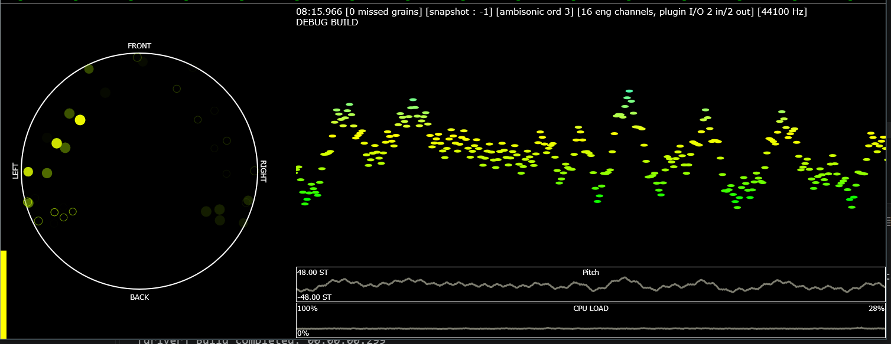

# Nephos - granular synthesizer

Grains from pure synthesis, spatialized into Ambisonics.

Granular synthesis has largely by now become to mean granulating audio files/buffers/samples, but Nephos takes
a different approach and generates its grains from classic waveforms (sine, semisine, triangle, saw, square) as well as simple FM synthesis and noise generators. While these might not be the most interesting sound sources by themselves, via additional parameters, grain internal envelopes and insert filters/effects per grain, much more variety can be achieved. This also goes back to the beginnings of granular synthesis in the 1950s when for example Iannis Xenakis used sine wave generators to produce grains for the tape composition Analogique B.

Spatialization of the grains is an important aspect of Nephos. Instead of panning each grain directly into stereo, quad or 5.0 surround etc speaker arrangement, it uses Ambisonics, up to 7th order for the spatial placement. The user then needs to decode that Ambisonics signal as desired. For simple stereo use, a built-in decoder (essentially M/S-decoding) may be left in. However, it is recommended to use Nephos properly with Ambisonics in a DAW that supports the required channel counts to pass the Ambisonics signals, for example 16 channels for 3rd order Ambisonics.

